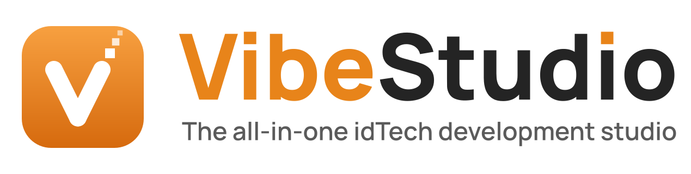

<p align="center">
  <picture>
    <source media="(prefers-color-scheme: dark)" srcset="assets/branding/logo/vibestudio-banner-on-dark.svg">
    
  </picture>
</p>

<p align="center">
  <a href="https://github.com/themuffinator/VibeStudio/releases"></a>
  <a href="docs/manual/status.md"></a>
  
  <a href="LICENSE"></a>
  <a href="https://github.com/themuffinator/VibeStudio/actions/workflows/pr-ci.yml"></a>
</p>

<p align="center">
  <b><a href="docs/manual/install.md">Download</a></b> &nbsp;·&nbsp;
  <b><a href="docs/manual/index.md">Documentation</a></b> &nbsp;·&nbsp;
  <b><a href="docs/manual/status.md">Project status</a></b> &nbsp;·&nbsp;
  <b><a href="CHANGELOG.md">Changelog</a></b>
</p>

**VibeStudio** is an open-source development studio for **idTech 1, 2 and 3**
games: Doom, Quake, Quake II, Quake III Arena and their families. Level
editing, models, textures, audio, packages, code, compilers and game launching
share one window on Windows, macOS and Linux, and a command line drives the
same services for scripts and automation. An AI assistant is available, but
optional and off by default.

> [!WARNING]
> **VibeStudio is pre-alpha and highly untested.** Most features have
> automated tests, but very few have been used in real projects, the installers
> are new, and many planned parts of the studio don't exist yet. Work on copies
> of your files and keep backups. [Project status](docs/manual/status.md)
> explains what is and isn't tested.

## What's inside

| Area | What works today | Status |
| --- | --- | --- |
| [Levels](docs/manual/levels.md) | Open, edit and save Doom-family maps (including UDMF properties) and Quake, Quake II and Quake III `.map` files in 2D and 3D views, with undo, validation and backups | Partial |
| [Editor profiles](docs/manual/editor-profiles.md) | The keys, mouse gestures and camera of TrenchBroom, NetRadiant Custom, GtkRadiant, QuArK, Hammer, Ultimate Doom Builder and more | Partial |
| [Packages](docs/manual/packages.md) | Browse, extract, validate and compare PAK, WAD, ZIP and PK3 files; stage changes and save a new package | Available |
| [Models](docs/manual/models.md) | View and animate MDL, MD2 and MD3; edit meshes; export to the game formats | Partial |
| [Textures](docs/manual/textures.md) | Decode idTech images with their palettes; paint in a layered editor; export to the game formats | Partial |
| [Audio](docs/manual/audio.md) | Preview, edit and analyse game sounds; multitrack sessions (no playback in Linux builds yet) | Partial |
| [Materials and shaders](docs/manual/materials.md) | Every texture, Quake III shader and Doom 3 material of idTech 1 to 4, previewed live and animated by each engine's rules, checked, and edited as text or as nodes | Partial |
| [Code](docs/manual/code.md) | Edit QuakeC, shader scripts and configs with highlighting, search and language servers | Partial |
| [Build and launch](docs/manual/build-and-launch.md) | Run ericw-tools, q3map2, ZDBSP and ZokumBSP pipelines, jump to problems and leaks, and launch the game | Partial |
| [AI assistant](docs/manual/ai.md) | Optional and off by default; ask a model about your work, or generate levels, textures and sounds for review | Partial |
| [Command line](docs/manual/cli.md) | 261 scriptable commands in 27 families with JSON output | Available |
| [Accessibility and languages](docs/manual/accessibility.md) | High-contrast themes, text up to 200%, full keyboard use, screen reader support; 47 languages registered, none translated yet | Partial |

**Available** means implemented and covered by automated tests, but not yet
proven in real projects. **Partial** means some formats or workflows work; each
page lists the gaps.

## Install

Pre-built downloads are on the [Releases page](https://github.com/themuffinator/VibeStudio/releases).
Every release lists its files with a `SHA256SUMS.txt`; pre-release versions are
marked as such.

| Platform | Download | First launch |
| --- | --- | --- |
| Windows 10/11 (x64) | `VibeStudio-<version>-windows-x64-setup.exe`, or the `-portable.zip` | Not code-signed yet: **More info** > **Run anyway** |
| macOS 13+ (Apple silicon) | `VibeStudio-<version>-macos-arm64.dmg` | Not notarised yet: Control-click the app > **Open** |
| Linux (x86_64) | `VibeStudio-<version>-linux-x86_64.AppImage` | `chmod +x` it; needs FUSE 2 |

Each download includes the offline HTML documentation. Builds of `main` are
available as artifacts of the [nightly workflow](https://github.com/themuffinator/VibeStudio/actions/workflows/release-nightly.yml)
(sign-in required). [Install VibeStudio](docs/manual/install.md) covers every
step, checksums, and where settings live.

## Quick start

1. Install and launch VibeStudio.
2. Open **Settings** > **Getting Started** and run the checklist: language,
   accessibility, theme, editor profile, games and compilers. Every choice can
   be changed later.
3. Drop a map, package or project folder onto the window, or try the
   license-clean projects in `samples/`.
4. Press <kbd>Ctrl</kbd>+<kbd>Shift</kbd>+<kbd>P</kbd> (<kbd>Cmd</kbd> on macOS)
   to search every command.

[A tour of the studio](docs/manual/tour.md) explains the window, pages and panels.

## Documentation

- **[User manual](docs/manual/index.md)**: installing, the studio's pages, the
  command line and troubleshooting. Every release ships it as offline HTML
  (`docs/html/index.html`, or **VibeStudio Documentation** in the Windows Start
  menu).
- **[Documentation index](docs/README.md)**: the manual plus contributor guides
  and the design records for each part of the studio.
- **[Changelog](CHANGELOG.md)**: what changed in each release.

## CLI Quick Reference

The command line shares the studio's services, project state and validation.
Run it as `vibestudio --cli` (on Windows `vibestudio.exe`; see
[Command line](docs/manual/cli.md) for the macOS and AppImage paths).

```sh
vibestudio --cli --help                                   # usage and global options
vibestudio --cli cli commands                             # every command, by family
vibestudio --cli package validate ./pak0.pak --json       # check a package
vibestudio --cli map render ./maps/start.map --output ./start.svg --projection top
vibestudio --cli build run quake-full --input ./maps/start.map --watch
vibestudio --cli localization targets                     # the 47 interface languages
vibestudio --cli diagnostics bundle --output ./diagnostics
vibestudio --cli ui semantics --json                      # commands, shortcuts and accessibility metadata
```

Add `--json` for machine-readable output and `--settings-file <path>` to keep
scripted runs away from your own preferences. The full reference is
[docs/CLI_STRATEGY.md](docs/CLI_STRATEGY.md).

## Build from source

You need a C++20 compiler, Qt 6 (CI uses 6.10.1) with Core, Gui, Widgets and
Network (Multimedia optional), Meson, Ninja and Python 3.

```sh
git clone --recursive https://github.com/themuffinator/VibeStudio.git
cd VibeStudio
meson setup builddir --backend ninja
meson compile -C builddir
meson test -C builddir --print-errorlogs
```

On Windows, `pwsh -File scripts/meson_build.ps1` finds Qt and clang-cl for you,
and the repository's VS Code tasks build, test, launch and debug.
[Build from source](docs/manual/building-from-source.md) has the details.

## Contributing

Contributions are welcome. Read [Contributing](docs/CONTRIBUTING.md) first:
every change keeps the CLI, docs, credits and translations in step, and every
user-visible change adds a line to the [changelog](CHANGELOG.md).
[Releasing](docs/RELEASING.md) explains versions and releases, and
[Branding](docs/BRANDING.md) the logo, colours and writing style.

## Built with

C++20 and [Qt 6](https://www.qt.io/) Widgets, built with
[Meson](https://mesonbuild.com/) and Ninja. Compression, image decoding and map
parsing are written in-house; audio uses pinned copies of dr_libs, Xiph's
libogg and libvorbis, libebur128, r8brain and PortAudio, and UV atlases use
xatlas. Level compilers are Git submodules under `external/compilers`.
[docs/STACK.md](docs/STACK.md) records the stack decisions and
[docs/DEPENDENCIES.md](docs/DEPENDENCIES.md) every dependency.

## Credits

VibeStudio is created by [themuffinator](https://github.com/themuffinator)
(DarkMatter Productions). It stands on the work of many projects; every
borrowed idea, format, pattern and line of code is credited here and in full in
[docs/CREDITS.md](docs/CREDITS.md), with upstream links, licences and pinned
revisions.

| Upstream | Used for | Licence | Pinned revision |
| --- | --- | --- | --- |
| [PakFu](https://github.com/themuffinator/PakFu) | Package, archive, format and installation reference; DDS/FTX/SWL codecs | GPL-3.0 | `13111e4c` |
| [ericw-tools](https://github.com/ericwa/ericw-tools) | Quake/idTech2 compilers (submodule) | GPL-2.0-or-later | `f80b1e216a415581aea7475cb52b16b8c4859084` |
| q3map2 from [NetRadiant Custom](https://github.com/Garux/netradiant-custom) | Quake III compiler (submodule) | GPL (repository mixes GPL, LGPL and BSD) | `68ecbed64b7be78741878c730279b5471d978c7c` |
| [ZDBSP](https://github.com/rheit/zdbsp) | Doom node builder (submodule) | GPL-2.0-or-later | `bcb9bdbcaf8ad296242c03cf3f9bff7ee732f659` |
| [ZokumBSP](https://github.com/zokum-no/zokumbsp) | Doom node, blockmap and reject builder (submodule) | GPL-2.0 | `22af6defeb84ce836e0b184d6be5e80f127d9451` |
| [r8brain-free-src](https://github.com/avaneev/r8brain-free-src) 7.5 | Sample-rate conversion | MIT | `cb2abb9977efe2471979b380ed95daa56ab4fdb9` |
| [dr_libs](https://github.com/mackron/dr_libs) (dr_mp3, dr_flac) | MP3 and FLAC decoding | MIT-0 | `dfe8377631000664666519fdb83da193fd8037f4` |
| [libogg](https://github.com/xiph/ogg) 1.3.6 and [libvorbis](https://github.com/xiph/vorbis) 1.3.7 | Ogg Vorbis decoding | BSD-3-Clause | `be05b13e98b048f0b5a0f5fa8ce514d56db5f822`, `c2aa86b05e981c96bf381fc6aa11cdd03eccc2fb` |
| [libebur128](https://github.com/jiixyj/libebur128) 1.2.6 | Loudness metering | MIT | `67b33abe1558160ed76ada1322329b0e9e058b02` |
| [PortAudio](https://github.com/PortAudio/portaudio) | Synchronized recording backend | MIT-style | `873e3c83fbe2f57ebcf59083e627a3f8fa051ffe` |
| [xatlas](https://github.com/jpcy/xatlas) | Mesh UV atlas generation | MIT | `f700c7790aaa030e794b52ba7791a05c085faf0c` |
| [Manrope](https://github.com/sharanda/manrope) 4.504 | Brand typeface (logo, docs headings) | OFL-1.1 | 4.504 |

Editor profiles and workflows follow the behaviour (never the code) of
[GtkRadiant](https://github.com/TTimo/GtkRadiant), [NetRadiant Custom](https://github.com/Garux/netradiant-custom),
[TrenchBroom](https://trenchbroom.github.io/), [QuArK](https://quark.sourceforge.io/),
[QeRadiant's documented controls](https://icculus.org/gtkradiant/documentation/q3radiant_manual/appndx/sskey_dl.htm)
and other editors. Optional AI connectors target [OpenAI](https://platform.openai.com/docs/quickstart),
[Claude](https://platform.claude.com/docs/en/home), [Gemini](https://ai.google.dev/api),
[ElevenLabs](https://elevenlabs.io/docs/overview/intro) and [Meshy](https://docs.meshy.ai/en).
The release flow follows the pattern of [FnQL](https://github.com/themuffinator/FnQL)'s
versioning and changelog tooling (pattern only; the scripts are original).

<details>
<summary><b>Full attribution</b>: every reference, specification and pattern, with licences and review dates</summary>

The level generator follows the pipeline design of
[Quake-MapGen](https://github.com/themuffinator/Quake-MapGen) (MIT, `1252548`,
2026-08-26, reviewed 2026-10-06), and the texture generator the prompt design
and derived-layer idea of [TexAI](https://github.com/themuffinator/TexAI)
(GPL-3.0, `7f56a4b`, 2026-02-14); the sound synthesizer follows the preset
kinds and voice model of DrPetter's [sfxr](https://drpetter.se/project_sfxr.html)
(MIT, 2007, reviewed 2026-10-06). All are original implementations with no
code copied. See [Generative Level, Texture, And Sound Design](docs/CREDITS.md#generative-level-texture-and-sound-design-2026-10-06).

The model decoders and writers for idTech 1 to idTech 4 formats follow the
public layouts and behaviour of the [Doom 3](https://github.com/id-Software/DOOM-3),
[Return to Castle Wolfenstein](https://github.com/id-Software/RTCW-SP) and
[Enemy Territory](https://github.com/id-Software/Enemy-Territory) GPL sources,
[ioquake3](https://github.com/ioquake/ioq3), the [IQM](https://github.com/lsalzman/iqm)
specification (MIT), [OpenJK](https://github.com/JACoders/OpenJK) (GPL-2.0 only, so
reimplemented with nothing copied), [Xash3D FWGS](https://github.com/FWGS/xash3d-fwgs),
[uHexen2](https://github.com/sezero/uhexen2), GtkRadiant's `qdata_heretic2`,
[Heretic2R](https://github.com/m-x-d/Heretic2R), [GZDoom](https://github.com/ZDoom/gzdoom)
and picomodel, all read 2026-10-08. The modeller's controls profiles follow the
documented behaviour (never the code) of Blender, Autodesk 3ds Max and
MilkShape 3D. See [Native Model Formats And Modeller Profiles](docs/CREDITS.md#native-model-formats-and-modeller-profiles-2026-10-08).

The materials module (Materials page and `material` commands) reimplements
surface rules read in the GPL sources of [Quake III Arena](https://github.com/id-Software/Quake-III-Arena),
[ioquake3](https://github.com/ioquake/ioq3), [Enemy Territory](https://github.com/id-Software/Enemy-Territory), [Doom 3](https://github.com/id-Software/DOOM-3),
[Doom 3 BFG](https://github.com/id-Software/DOOM-3-BFG), [Doom](https://github.com/id-Software/DOOM),
[Quake](https://github.com/id-Software/Quake), [Quake II](https://github.com/id-Software/Quake-2)
and their re-release code, Boom's SWANTBLS format via [SMMU](https://github.com/fragglet/smmu),
ZDoom's ANIMDEFS, [ericw-tools](https://github.com/ericwa/ericw-tools)' `.wal_json`, and
QuakeSpasm, DarkPlaces and FTE companion images, reviewed 2026-10-07 to 2026-10-08.
No code or game data is copied. See [Materials, Shaders And Textures](docs/CREDITS.md#materials-shaders-and-textures-2026-10-08).

Placed MD3 compiler appearances follow NetRadiant Custom's
[q3map2 model contract](https://github.com/Garux/netradiant-custom/blob/68ecbed64b7be78741878c730279b5471d978c7c/tools/quake3/q3map2/model.cpp)
(GPL-2.0-or-later) and its bundled
[Assimp MD3 importer](https://github.com/Garux/netradiant-custom/blob/68ecbed64b7be78741878c730279b5471d978c7c/libs/assimp/code/AssetLib/MD3/MD3Loader.cpp)
(BSD-3-Clause), revision `68ecbed`, reviewed 2026-10-06. See
[the implementation and licence review](docs/CREDITS.md#placed-model-compiler-appearances).

ZIP/PK3 metadata parsing follows [PKWARE APPNOTE 6.3.10](https://pkware.cachefly.net/webdocs/casestudies/APPNOTE.TXT)
(2022-11-01). Legacy filename decoding uses the [Unicode CP437 mapping](https://www.unicode.org/Public/MAPPINGS/VENDORS/MICSFT/PC/CP437.TXT)
(table 2.00, 1996-04-24), under [Unicode License V3](docs/licenses/UNICODE-LICENSE.txt).
See [archive-format credits](docs/CREDITS.md#compression-and-archive-formats) for the implementation and licence review.

Session reverb derives its topology and delay tuning from Jezar at Dreampoint's
public-domain [Freeverb Components](https://github.com/sinshu/freeverb/tree/cfcea55553fb59ac57ebf2a237f72cad4296f2b0/Components)
(June 2000), with original stereo, decay, damping and history handling. Details
and licence review are in [Credits](docs/CREDITS.md#audio-reverb-reference).

Session EQ uses an original C++ implementation of Robert Bristow-Johnson's
[Audio EQ Cookbook coefficients](https://www.w3.org/TR/2021/NOTE-audio-eq-cookbook-20210608/),
W3C Note dated 2021-06-08, under the GPL-compatible W3C Software and Document
License (2015). Reference, review and preserved notices are in
[Credits](docs/CREDITS.md#audio-session-eq).

- Model `.skin` authoring references Quake III's
  [skin reader](https://github.com/id-Software/Quake-III-Arena/blob/master/code/renderer/tr_image.c),
  [surface normalization](https://github.com/id-Software/Quake-III-Arena/blob/master/code/renderer/tr_model.c)
  and [shader lookup](https://github.com/id-Software/Quake-III-Arena/blob/master/code/renderer/tr_mesh.c),
  GPL-2.0-or-later, local `master` reviewed 2026-10-05. No upstream code or game
  assets copied; see [Model Skin Bindings](docs/CREDITS.md#model-skin-bindings).
  The same credited reader supplies non-destructive linked skins in model assemblies.

- Model native winding and tag conventions follow id Software's
  [Quake](https://github.com/id-Software/Quake/blob/master/WinQuake/gl_rmain.c),
  [Quake II](https://github.com/id-Software/Quake-2/blob/master/ref_gl/gl_rmain.c)
  and [Quake III](https://github.com/id-Software/Quake-III-Arena/blob/master/code/renderer/tr_model.c)
  sources, GPL-2.0-or-later, `master` reviewed 2026-10-05. The optional
  [FTE](https://github.com/fte-team/fteqw) dedicated-server and offscreen EGL
  rendering tests use public QuakeC/MenuQC interfaces and generated assets.
  The nested assembly bake fixture and shared headless runner extend those
  tests with original pose, normal and pixel oracles, reviewed 2026-10-06.
  Native skin-padding guidance follows Quake's
  [GL skin loader](https://github.com/id-Software/Quake/blob/master/WinQuake/gl_model.c),
  under the same licence/review date. FTE retains its GPL notices and stays a
  separate external tool; source/interface
  provenance and compatibility findings are in
  [Credits](docs/CREDITS.md#model-native-engine-acceptance) and
  [Model Engine Acceptance](docs/MODEL_ENGINE_ACCEPTANCE.md).

- Additional level-editor familiarity references: [Hammer/Worldcraft](https://developer.valvesoftware.com/wiki/Hammer_Hotkey_Reference),
  [J.A.C.K.](https://jack.hlfx.ru/en/main.html), [DarkRadiant](https://www.darkradiant.net/userguide/),
  [Doom Builder/UDB](https://github.com/UltimateDoomBuilder/UltimateDoomBuilder),
  [SLADE](https://github.com/sirjuddington/SLADE), [Eureka](https://github.com/ioan-chera/eureka-editor),
  [Unreal](https://dev.epicgames.com/documentation/en-us/unreal-engine/viewport-controls-in-unreal-engine),
  [Unity](https://docs.unity3d.com/Manual/SceneViewNavigation.html),
  [Godot](https://docs.godotengine.org/en/stable/tutorials/3d/introduction_to_3d.html) and
  [Blender](https://docs.blender.org/manual/en/latest/editors/3dview/navigate/index.html).
  Independent behavior adaptations only; no upstream code/assets incorporated.
  Reference revisions, licenses and differences are recorded in [Credits](docs/CREDITS.md)
  and [Editor Profiles](docs/EDITOR_PROFILES.md).

- The Levels sidebars follow the pattern of [Blender's sidebar](https://docs.blender.org/manual/en/latest/interface/window_system/regions.html#sidebar)
  and [VibeRadiant's tabbed asset browser](https://github.com/themuffinator/VibeRadiant/blob/f2fb5340333099dc8767c8d08f7e4757b8d23a02/radiant/assetbrowser.cpp)
  (GPL-2.0, `f2fb534`); the Shapes tab and level tools follow the behaviour of Hammer, J.A.C.K., Sledge, TrenchBroom
  (including its linked groups), NetRadiant Custom and
  [Q3Radiant](https://github.com/id-Software/Quake-III-Arena/blob/dbe4ddb10315479fc00086f08e25d968b4b43c49/q3radiant/SELECT.CPP).
  The built-in entity catalogues record facts from id Software's GPL Quake, Quake II and Quake III Arena game and
  tool sources and the ericw-tools qbsp documentation, in VibeStudio's own words. Original code throughout; see
  [Level Editor Sidebars, Shapes And Tools](docs/CREDITS.md#level-editor-sidebars-shapes-and-tools-2026-10-08).

- Standalone [NetRadiant controls](https://github.com/xonotic/netradiant/tree/b4b295d7a37797cc2752e48aa8ce42492e7016f0/radiant),
  revision `b4b295d7a37797cc2752e48aa8ce42492e7016f0` (GPL-2.0-or-later), and
  [Sledge 2.0.7.2 navigation](https://github.com/LogicAndTrick/sledge/tree/8762a6de07a9fa486d51aff0913cdc0306fd775c/Sledge.BspEditor.Rendering/Viewport),
  revision `8762a6de07a9fa486d51aff0913cdc0306fd775c` (BSD-3-Clause), inform
  independent profile and temporary-navigation behavior. Both licences were
  reviewed for GPLv3 compatibility on 2026-10-05. No upstream code or assets
  copied; [pinned modules and differences](docs/CREDITS.md#editor-workflow-inspirations)
  accompany the implementation.

- [id Software Q3Radiant](https://github.com/id-Software/Quake-III-Arena/tree/dbe4ddb10315479fc00086f08e25d968b4b43c49/q3radiant),
  revision `dbe4ddb10315479fc00086f08e25d968b4b43c49`, informs classic profile,
  position-steering and fixed camera-step behavior. `MainFrm.cpp` also informs
  the profile's texture shift, rotation and fit shortcuts; quick surface
  operations retain VibeStudio's documented UV mapping rules. `CamWnd.cpp`, `MainFrm.cpp`
  and the plan/preferences modules are GPL-2.0-or-later, reviewed as GPLv3-compatible
  on 2026-10-06. The Qt implementation is independent; no game assets are used.
  [Detailed credits and remaining differences](docs/CREDITS.md#editor-workflow-inspirations).

- [DoomEdit](https://github.com/id-Software/DOOM-3/tree/a9c49da5afb18201d31e3f0a429a037e56ce2b9a/neo/tools/radiant)
  (revision `a9c49da5`, GPL-3.0-or-later with additional terms) and
  [BSP Quake Editor 0.97q7](https://www.bspquakeeditor.com/downloads.php)
  (proprietary reference) inform independent navigation/profile adaptations.
  Reviewed 2026-10-07; binding facts only, no code, configuration prose or game
  assets imported. [Exact sources and scope](docs/CREDITS.md#editor-workflow-inspirations).

- Level workspace maximization and sizing keys follow the
  [original Hammer 3.4 reference](https://documentation.help/Valve-Hammer-Editor-3.4/Hotkey_Reference.htm),
  [J.A.C.K. 1.1 manual](https://valvedev.info/tools/jack/jack_manual.pdf) and
  [NetRadiant Custom command registration](https://github.com/Garux/netradiant-custom/blob/68ecbed64b7be78741878c730279b5471d978c7c/radiant/mainframe.cpp).
  Original VibeStudio implementation; behavioral facts only. Licenses and review
  date are recorded in [Credits](docs/CREDITS.md#editor-workflow-inspirations).

### Additional asset exchange credits

DDS decoding and FTX/SWL format knowledge and image writing derive from
[PakFu's format modules](https://github.com/themuffinator/PakFu/tree/13111e4c07513548a29fd7eb74fc9d004c44aa59/src/formats),
GPL-3.0, local working snapshot reviewed 2026-10-05 based on `13111e4c`.
The shared capability catalog follows its explicit support-tier approach.
See [codec provenance](docs/CREDITS.md#pakfu-image-exchange-and-capability-catalog).


- Model clip-brush conventions reference [ericw-tools' Quake hull handling](https://github.com/ericwa/ericw-tools/blob/f80b1e216a415581aea7475cb52b16b8c4859084/qbsp/brush.cc), id Software's [Quake II contents/masks](https://github.com/id-Software/Quake-2/blob/master/game/q_shared.h) and [Quake III shader-driven contents](https://github.com/id-Software/Quake-III-Arena/blob/master/q3map/map.c). GPL-2.0-or-later reference interfaces, reviewed 2026-10-05; no upstream implementation or game assets imported. See [collision credits](docs/CREDITS.md#model-collision).
- Collision compiler tests independently read BSP layouts documented by [ericw-tools](https://github.com/ericwa/ericw-tools/tree/f80b1e216a415581aea7475cb52b16b8c4859084/include/common) and [NetRadiant Custom](https://github.com/Garux/netradiant-custom/blob/68ecbed64b7be78741878c730279b5471d978c7c/tools/quake3/q3map2/q3map2.h), GPL-2.0-or-later references reviewed 2026-10-05. Generated assets and test implementations are original; [pinned files and licenses](docs/CREDITS.md#model-collision) accompany the workflow.

- UDMF property authoring follows format facts in [UDMF v1.1](https://github.com/rheit/zdoom/blob/master/specs/udmf.txt)
  (James Haley, 2009-03-29, GFDL-1.2-or-later; reference only) and the interface in
  [ZDBSP `processor_udmf.cpp`](https://github.com/rheit/zdbsp/blob/bcb9bdbcaf8ad296242c03cf3f9bff7ee732f659/processor_udmf.cpp)
  (Christoph Oelckers, GPL-2.0-or-later, pinned revision above; reviewed 2026-10-05).
  The parser, native transform encoding and fixtures are original. Native mirrors
  reuse the credited [Doom reflection rules](docs/CREDITS.md#doom-geometry-reflection).
  Polyobject control roles follow the pinned [ZDBSP processor](https://github.com/rheit/zdbsp/blob/bcb9bdbcaf8ad296242c03cf3f9bff7ee732f659/processor.cpp)
  format facts (GPL-2.0-or-later, Randy Heit, reviewed 2026-10-05).
  See [detailed credits](docs/CREDITS.md#udmf-parser-and-property-authoring).

- Doom node readiness uses original bounded readers of the layouts written by
  [ZDBSP `processor.cpp`](https://github.com/rheit/zdbsp/blob/bcb9bdbcaf8ad296242c03cf3f9bff7ee732f659/processor.cpp),
  revision `bcb9bdbcaf8ad296242c03cf3f9bff7ee732f659`, reviewed 2026-10-05.
  GPL-2.0-or-later (Randy Heit), compatible with VibeStudio's GPL-3.0;
  no upstream implementation copied. Editor saves, compiler output checks and
  Doom launch plans share this validation. See [node readiness](docs/LEVEL_EDITOR.md#doom-node-readiness).

- Doom detached reflection workflow: [Ultimate Doom Builder, EditSelectionMode.cs](https://github.com/jewalky/UltimateDoomBuilder/blob/6d9f6038db30adfee0edd74221b74b2de4837f6f/Source/Plugins/BuilderModes/ClassicModes/EditSelectionMode.cs),
  revision `6d9f6038db30adfee0edd74221b74b2de4837f6f`, GPL-3.0, reviewed 2026-10-05.
  Endpoint reversal with retained side ownership is a behaviour reference; no
  C# source is copied. [Detailed credit and scope](docs/CREDITS.md#doom-geometry-reflection).
- Prepared Quake-family builds use interface facts from [ericw-tools settings and filesystem handling](https://github.com/ericwa/ericw-tools/tree/f80b1e216a415581aea7475cb52b16b8c4859084/common), [qbsp](https://github.com/ericwa/ericw-tools/tree/f80b1e216a415581aea7475cb52b16b8c4859084/qbsp), and the BSP dialect handling in [VIS](https://github.com/ericwa/ericw-tools/tree/f80b1e216a415581aea7475cb52b16b8c4859084/vis) and [LIGHT](https://github.com/ericwa/ericw-tools/tree/f80b1e216a415581aea7475cb52b16b8c4859084/light), revision `f80b1e216a415581aea7475cb52b16b8c4859084`, and id Software's [Quake WAD2/miptex layouts](https://github.com/id-Software/Quake/tree/master/WinQuake). GPL-2.0-or-later references reviewed for GPL-3.0 compatibility on 2026-10-05; no upstream implementation or game assets copied. See [detailed credits](docs/CREDITS.md#prepared-quake-family-builds).
- Prepared-build deployment launch flags were checked against id Software's [Quake III filesystem](https://github.com/id-Software/Quake-III-Arena/blob/master/code/qcommon/files.c), [startup command handling](https://github.com/id-Software/Quake-III-Arena/blob/master/code/qcommon/common.c) and [renderer settings](https://github.com/id-Software/Quake-III-Arena/blob/master/code/renderer/tr_init.c), local `master` reviewed 2026-10-05. GPL-2.0-or-later interface references; no upstream implementation copied. See [Credits](docs/CREDITS.md#core-technology).
- Classic PAK numbering and launch interfaces follow id Software's [Quake filesystem](https://github.com/id-Software/Quake/blob/master/WinQuake/common.c) and [Quake II filesystem](https://github.com/id-Software/Quake-2/blob/master/qcommon/files.c), with their video/startup source references. Local `master` snapshots reviewed 2026-10-05, GPL-2.0-or-later compatible with GPL-3.0; no implementation copied. See [Classic Prepared Deployment credits](docs/CREDITS.md#classic-prepared-deployment).

Doom camera texture layout and wall anchors reference
[Chocolate Doom 3.1.0](https://github.com/chocolate-doom/chocolate-doom/tree/chocolate-doom-3.1.0/src/doom)
(`r_data.c`, `r_segs.c`, GPL-2.0-or-later; compatibility reviewed 2026-10-04).
The [credits record](docs/CREDITS.md#doom-camera-materials) identifies the
adaptations and original VibeStudio components.

Shared WAD subset/edit map-group recognition and new-document assembly use the format contracts in
[ZDBSP `wad.cpp`](https://github.com/rheit/zdbsp/blob/bcb9bdbcaf8ad296242c03cf3f9bff7ee732f659/wad.cpp)
(revision `bcb9bdbcaf8ad296242c03cf3f9bff7ee732f659`, GPL-2.0-or-later, reviewed
for GPL-3.0 compatibility on 2026-10-04). VibeStudio owns the implementation;
no upstream source was copied.

Mesh Editor edit mode (menus, keymap, modal transforms, selection operators,
proportional editing, the 3D cursor and Adjust Last Operation) follows the
documented behaviour of [Blender](https://www.blender.org/) (GPL-2.0-or-later,
reviewed 2026-10-07; no code used), and decimation implements Garland and
Heckbert's [quadric error metric](https://doi.org/10.1145/258734.258849)
(SIGGRAPH 1997). See [Blender-Style Mesh Editing](docs/CREDITS.md#blender-style-mesh-editing-2026-10-07).

Automatic mesh UV charting and packing use Jonathan Young's
[xatlas](https://github.com/jpcy/xatlas/tree/f700c7790aaa030e794b52ba7791a05c085faf0c),
revision `f700c7790aaa030e794b52ba7791a05c085faf0c`, with MIT-licensed
thekla_atlas/NVIDIA and Fast-BVH ancestry and BSD-3-Clause OpenNL code. These
terms were reviewed for GPLv3 compatibility on 2026-10-04. Original notices and
the reviewed indexed-seam, shape-preserving and rectangular-packing build
adaptations (the latter reviewed 2026-10-06) are documented in the
[integration record](external/modelling/xatlas/VIBESTUDIO.md).

- Project search preserves the public [Qt non-path glob contract](https://doc.qt.io/qt-6/qregularexpression.html#WildcardConversionOption-enum)
  on Qt 6.0–6.5 through an original compatibility adapter. Qt 6.4.2/6.10.1,
  GPL-3.0/LGPL-3.0, reviewed 2026-10-04; no Qt code or documentation prose copied.

Saved-draft reader protection uses an original GPL-3.0 VibeStudio adapter to the
public [Windows directory sharing](https://learn.microsoft.com/en-us/windows/win32/api/fileapi/nf-fileapi-createfilew),
[Linux flock](https://man7.org/linux/man-pages/man2/flock.2.html) and
[Apple flock](https://developer.apple.com/library/archive/documentation/System/Conceptual/ManPages_iPhoneOS/man2/flock.2.html)
contracts, reviewed 2026-10-04. No external source code or documentation prose was
copied. These operating-system APIs add no bundled library. Working-import
lock recovery additionally uses original adapters to
[Windows handle deletion](https://learn.microsoft.com/en-us/windows/win32/api/fileapi/nf-fileapi-setfileinformationbyhandle),
cross-checked against the [Qt 6.10.1 lock implementation](https://github.com/qt/qtbase/tree/v6.10.1/src/corelib/io)
(GPL-3.0/LGPL-3.0, compatible with this GPL-3.0 repository), reviewed
2026-10-04. No source or documentation prose was copied.


Multitrack streaming uses an original adapter to the public
[QAudioSink API](https://doc.qt.io/qt-6.10/qaudiosink.html), checked against Qt
6.4.2/6.10.1 (GPL-3.0/LGPL-3.0), 2026-10-05. No Qt code or prose was copied.
See [Audio Editor](docs/AUDIO_EDITOR.md#multitrack-sessions) for frame transport,
selected output, buffering and device-acceptance limits.

Recording uses original adapters to Qt's
[QAudioSource](https://doc.qt.io/qt-6.10/qaudiosource.html) and
[permissions](https://doc.qt.io/qt-6.10/permissions.html), plus guarded OS flush and
macOS bundle-description APIs, reviewed 2026-10-05. Existing Qt GPL-3.0/LGPL-3.0
and system-runtime dependencies remain compatible; no upstream code or prose was
copied. See [recording API credits](docs/CREDITS.md#recording-apis).

Editor and browser audio transport follow the public [Qt Multimedia media API](https://doc.qt.io/qt-6.10/qmediaplayer.html)
and [device API](https://doc.qt.io/qt-6.10/qmediadevices.html), reviewed against Qt
6.10.1 headers on 2026-10-04. Qt 6.4.2's
[FFmpeg end-of-stream behavior](https://github.com/qt/qtmultimedia/blob/v6.4.2/src/plugins/multimedia/ffmpeg/qffmpegmediaplayer.cpp)
also informed verification of the original deferred loop-restart fallback.
The existing GPL-3.0-compatible Qt dependency is unchanged; no Qt source or
documentation text was copied. See [credits](docs/CREDITS.md#core-technology).

Audio level placement and speaker dependency paths follow id Software's
[Quake II speaker](https://github.com/id-Software/Quake-2/blob/master/game/g_target.c),
[sound loader](https://github.com/id-Software/Quake-2/blob/master/client/snd_mem.c),
and [Quake III speaker](https://github.com/id-Software/Quake-III-Arena/blob/master/code/game/g_target.c)
contracts (master reviewed 2026-10-04, GPL-2.0-or-later, compatible with GPL-3.0).
The transaction, validation and UI code are original; no game data or entity
definitions are shipped. See [source and licence details](docs/CREDITS.md#audio-level-placement).

Windows runtime packaging preserves [Qt's SPDX inventories](https://doc.qt.io/qt-6/sbom.html)
(CC0-1.0) and original Qt/FFmpeg licence notices, reviewed against Qt 6.10.1 on
2026-10-05. The original PE comparison follows Microsoft's
[PE/COFF specification](https://learn.microsoft.com/en-us/windows/win32/debug/pe-format)
without copying code or prose. See [runtime distribution credits](docs/CREDITS.md#runtime-distribution)
and the [deployment workflow](docs/PACKAGING.md#windows-qt-and-audio-runtime).

The local source-distribution audit also retains unchanged
[Qt 6.10.1 sources](https://download.qt.io/official_releases/qt/6.10/6.10.1/submodules/),
[Qt build recipes](https://github.com/qt/qt5/tree/56657e036f579ae0b858ae8c9659a0f7b7a53407),
[FFmpeg n7.1.2](https://github.com/FFmpeg/FFmpeg/tree/f893221c8d89cb798b829bebe71d55e1a3f242fd)
and [zlib 1.3.1](https://github.com/madler/zlib/releases/tag/v1.3.1), with original
notices and pinned hashes. Reviewed 2026-10-05; the selected LGPL/permissive
profile is compatible with GPL-3.0. See the
[source and licence details](docs/CREDITS.md#runtime-distribution).

Release source companions additionally preserve
[QtTools 6.10.1](https://github.com/qt/qttools/tree/9e0030f889168f7a0ec1bb47a7d7138a497b3c96)
and [QtShaderTools 6.10.1](https://github.com/qt/qtshadertools/tree/86c4b079a05c2dbe5fdb6f46ad9df8ef297487a9)
build-tool sources and notices. `lrelease` and `qsb` use GPL-3.0 with Qt's GPL
exception; Qt library components offer LGPL-3.0/GPL-3.0 alternatives.
Reviewed 2026-10-05; these add no application runtime dependency. See the
[source-companion workflow](docs/PACKAGING.md#source-companion).

Windows release orchestration records the fresh Meson build and verifies the
paired binary/source artifacts. Its SDK selection follows the documented
`QT_ROOT_DIR` output of [install-qt-action v4](https://github.com/jurplel/install-qt-action/tree/v4)
(MIT; reviewed 2026-10-05), already used by CI. The orchestration and fixtures
are original Python code; no action implementation was copied.

The optional synchronized recording backend uses [PortAudio](https://github.com/PortAudio/portaudio/tree/873e3c83fbe2f57ebcf59083e627a3f8fa051ffe),
revision `873e3c83fbe2f57ebcf59083e627a3f8fa051ffe`, under its GPLv3-compatible
MIT-style license. Original notices and hashes accompany the private Meson build;
reviewed WASAPI/CoreAudio fixes are generated separately. See the
[backend integration record](external/audio/portaudio/VIBESTUDIO.md).

Audio loudness metering uses Jan Kokemüller's [libebur128 1.2.6](https://github.com/jiixyj/libebur128/tree/67b33abe1558160ed76ada1322329b0e9e058b02),
revision `67b33abe1558160ed76ada1322329b0e9e058b02`. Its MIT library/R128Scan
notices and BSD-3-Clause internal queue were reviewed for GPLv3 compatibility
on 2026-10-04 and are preserved with the unmodified sources. See the
[metering credits](docs/CREDITS.md#audio-loudness-metering).

Compressed audio import uses David Reid's [dr_mp3 0.7.4 and dr_flac 0.13.4](https://github.com/mackron/dr_libs/tree/dfe8377631000664666519fdb83da193fd8037f4),
revision `dfe8377631000664666519fdb83da193fd8037f4`, under MIT-0;
dr_mp3 derives from the public-domain [minimp3](https://github.com/lieff/minimp3).
Vorbis uses Xiph.Org's BSD-3-Clause [libvorbis](https://github.com/xiph/vorbis/tree/c2aa86b05e981c96bf381fc6aa11cdd03eccc2fb),
revision `c2aa86b05e981c96bf381fc6aa11cdd03eccc2fb`, and
[libogg 1.3.6](https://github.com/xiph/ogg/tree/be05b13e98b048f0b5a0f5fa8ce514d56db5f822),
revision `be05b13e98b048f0b5a0f5fa8ce514d56db5f822`.
The licences were reviewed for GPLv3 compatibility on 2026-10-04. Unmodified
sources, hashes and notices live in `external/audio`; see [decoder credits](docs/CREDITS.md#compressed-audio-decoding).

The retained, unbuilt evaluation copy of Sean Barrett's
[stb_vorbis 1.22](https://github.com/nothings/stb/blob/2c980bb59875b0d32144a71867fbdebb2f77cd20/stb_vorbis.c)
uses the MIT alternative at revision `2c980bb59875b0d32144a71867fbdebb2f77cd20`.
It is excluded from the application and portable packages.

The original local language client, diagnostic/hover/signature/completion/snippet/formatting/rename/code-action parsers, workspace-edit and reference services follow Microsoft's
[LSP 3.17 specification](https://microsoft.github.io/language-server-protocol/specifications/lsp/3.17/specification/)
([CC-BY-4.0](https://github.com/microsoft/language-server-protocol/blob/gh-pages/License.txt),
reviewed 2026-10-04). Protocol facts only; no upstream code or prose was copied.
See [the full attribution](docs/CREDITS.md#language-server-protocol).
Completion-resolution and parameter-hint verification also use
[Pyright 1.1.414](https://github.com/microsoft/pyright/tree/1.1.414)
([MIT](https://github.com/microsoft/pyright/blob/1.1.414/LICENSE.txt), reviewed
2026-10-04) as an isolated test executable; it is not bundled with VibeStudio.
Pull-diagnostic verification uses [Ruff 0.16.4](https://github.com/astral-sh/ruff/tree/0.16.4)
under its [MIT license and third-party notices](https://github.com/astral-sh/ruff/blob/0.16.4/LICENSE),
reviewed 2026-10-04, as a separate test process. It is not bundled or linked.

Game sound delivery follows reader behaviour in
[Chocolate Doom 3.1.0 `i_sdlsound.c`](https://github.com/chocolate-doom/chocolate-doom/blob/chocolate-doom-3.1.0/src/i_sdlsound.c),
[Quake `WinQuake/snd_mem.c`](https://github.com/id-Software/Quake/blob/master/WinQuake/snd_mem.c),
[Quake II `client/snd_mem.c`](https://github.com/id-Software/Quake-2/blob/master/client/snd_mem.c), and
[Quake III `code/client/snd_mem.c`](https://github.com/id-Software/Quake-III-Arena/blob/master/code/client/snd_mem.c).
These GPL-2.0-or-later references are compatible with VibeStudio's GPL-3.0;
reviewed 2026-10-04 (the id repositories' master snapshots on that date).
Only format facts and compatibility behaviour are used; no engine code or game
assets are copied. Preset defaults and the delivery writer are VibeStudio's own.

WAV precision export follows factual Microsoft RIFF/WAVE and
[WAVEFORMATEXTENSIBLE layouts](https://learn.microsoft.com/en-us/windows-hardware/drivers/ddi/ksmedia/ns-ksmedia-waveformatextensible)
(2023-03-13 documentation, reviewed 2026-10-04), cross-checked with
[Peter Kabal's WAVE reference](https://www.mmsp.ece.mcgill.ca/Documents/AudioFormats/WAVE/WAVE.html)
(2022-09-27). The writer and dither are original code; no external source or
documentation text was copied.

Cue/loop metadata follows Microsoft's public
[RIFF 1991](https://www.mmsp.ece.mcgill.ca/Documents/AudioFormats/WAVE/Docs/riffmci.pdf)
and [1994 update](https://www.mmsp.ece.mcgill.ca/Documents/AudioFormats/WAVE/Docs/RIFFNEW.pdf)
format facts, plus the GPL-2.0-or-later Quake/II cue-and-length convention in the
engine references above (reviewed 2026-10-04). Implementation and editing rules
are original; no source code or specification prose is copied.

Level texture projection conventions follow [NetRadiant Custom's q3map2 mapping](https://github.com/Garux/netradiant-custom/blob/68ecbed64b7be78741878c730279b5471d978c7c/tools/quake3/q3map2/map.cpp), GPL-2.0-or-later, revision `68ecbed64b7be78741878c730279b5471d978c7c` (reviewed 2026-10-04). See [the detailed credits](docs/CREDITS.md) for source modules and preserved notices.

Sample rate converter designed by Aleksey Vaneev of Voxengo.
[r8brain-free-src 7.5](https://github.com/avaneev/r8brain-free-src/tree/cb2abb9977efe2471979b380ed95daa56ab4fdb9)
is included under MIT at revision `cb2abb9977efe2471979b380ed95daa56ab4fdb9`
(reviewed 2026-10-04), using [Takuya Ooura's FFT](https://www.kurims.kyoto-u.ac.jp/~ooura/fft.html)
under its permissive use/copy/modify/distribute licence. Both are compatible with
GPL-3.0; notices are preserved in `external/audio/r8brain-free-src` and release
licence bundles. See [integration details](external/audio/r8brain-free-src/VIBESTUDIO.md).

Patch authoring follows the format and 31-point control-axis limit in
[NetRadiant Custom's q3map2](https://github.com/Garux/netradiant-custom/blob/68ecbed64b7be78741878c730279b5471d978c7c/tools/quake3/q3map2/q3map2.h),
revision `68ecbed64b7be78741878c730279b5471d978c7c` (GPL-2.0-or-later),
reviewed 2026-10-04. The editor, presets and Bézier splitting are original code.
Patch material conversion and package lookup also follow its
[patch and brush token parsing](https://github.com/Garux/netradiant-custom/tree/68ecbed64b7be78741878c730279b5471d978c7c/tools/quake3/q3map2)
at the same revision and license.

- Empty Hexen ACS behavior data follows the layout checked against
  [Chocolate Doom 3.1.0, `P_LoadACScripts`](https://github.com/chocolate-doom/chocolate-doom/blob/chocolate-doom-3.1.0/src/hexen/p_acs.c)
  (GPL-2.0-or-later, compatible with this repository's GPL-3.0; reviewed
  2026-10-04). The starter map and recovery implementation are original; no
  upstream source or commercial assets are incorporated.
- Animated MD2 export follows [Quake II's format and renderer sources](https://github.com/id-Software/Quake-2/blob/master/qcommon/qfiles.h)
  and [Quake II Tools' texel-centre convention](https://github.com/id-Software/Quake-2-Tools/blob/master/qdata/models.c),
  reusing the published [normal table](https://github.com/id-Software/Quake-2/blob/master/ref_gl/anorms.h).
  All are GPL-2.0-or-later, `master` reviewed 2026-10-04, compatible with GPL-3.0.
  The writer, validation, and fixtures are original; details are in [Credits](docs/CREDITS.md).
- MDL native group/indexed-skin preservation and export follow Quake's
  [`modelgen.h`](https://github.com/id-Software/Quake/blob/master/WinQuake/modelgen.h)
  and [`model.c`](https://github.com/id-Software/Quake/blob/master/WinQuake/model.c),
  with renderer limits and compatibility from
  [`gl_model.c`](https://github.com/id-Software/Quake/blob/master/WinQuake/gl_model.c),
  [`gl_model.h`](https://github.com/id-Software/Quake/blob/master/WinQuake/gl_model.h)
  and [`gl_draw.c`](https://github.com/id-Software/Quake/blob/master/WinQuake/gl_draw.c)
  (GPL-2.0-or-later, `master` reviewed 2026-10-04, compatible with GPL-3.0).
  Native timing sampling also follows
  [`r_alias.c`](https://github.com/id-Software/Quake/blob/master/WinQuake/r_alias.c)
  and [`gl_rmain.c`](https://github.com/id-Software/Quake/blob/master/WinQuake/gl_rmain.c)
  under the same licence and review date. Storage, timing edits/sampling, seam packing, the writer and synthetic fixtures are
  original; no game assets are included.
- OBJ polygon import follows [Wavefront Advanced Visualizer 3.0 Appendix B1](https://www.martinreddy.net/gfx/3d/OBJ.spec)
  (reviewed 2026-10-05). The parser, bounded triangulation and synthetic fixtures
  are original GPL-3.0 repository code. The reference has no explicit licence
  grant; only format facts are used, with no reference code or prose incorporated.
  See [OBJ interchange](docs/MODEL_MESH.md#obj-polygon-interchange) for supported
  records and the remaining material-library conversion gap.
- Static model design and animated mesh MD3 export use the public layout in
  [id Software's Quake III `qfiles.h`](https://github.com/id-Software/Quake-III-Arena/blob/master/code/qcommon/qfiles.h)
  (GPL-2.0-or-later, `master` reviewed 2026-10-03). The connected staging and
  material workflow also draws conceptual inspiration from
  [PakFu's model surface representation](https://github.com/themuffinator/PakFu/blob/13111e4c07513548a29fd7eb74fc9d004c44aa59/src/formats/model.h)
  (GPL-3.0, revision `13111e4c`, local checkout reviewed 2026-10-03).
  Implementations and primitive fixtures are original; no upstream code or
  commercial game assets were imported. Details are in [Credits](docs/CREDITS.md).
  The animated writer's original-Quake-III surface limits also follow
  [`R_LoadMD3`](https://github.com/id-Software/Quake-III-Arena/blob/master/code/renderer/tr_model.c)
  (GPL-2.0-or-later, `master` reviewed 2026-10-04).
  Attachment orientation in `core/model_tags` follows the local-basis convention in
  [`CG_PositionEntityOnTag`](https://github.com/id-Software/Quake-III-Arena/blob/master/code/cgame/cg_ents.c)
  (same license, `master` reviewed 2026-10-04); authoring code and fixtures are original.
  Native player animation configuration follows Quake III's
  [`CG_ParseAnimationFile` / `CG_RunLerpFrame`](https://github.com/id-Software/Quake-III-Arena/blob/master/code/cgame/cg_players.c)
  and [animation roster](https://github.com/id-Software/Quake-III-Arena/blob/master/code/game/bg_public.h)
  (GPL-2.0-or-later, `master` reviewed 2026-10-06). The bounded production
  implementation and synthetic fixtures are original; see
  [Native Animation](docs/MODEL_ASSEMBLY.md#quake-iii-native-animation).
  Native player package layout and its optional loader oracle also reference
  that `cg_players.c`, plus skin parsing/TGA behavior in
  [`tr_image.c`](https://github.com/id-Software/Quake-III-Arena/blob/master/code/renderer/tr_image.c),
  [`tr_shader.c`](https://github.com/id-Software/Quake-III-Arena/blob/master/code/renderer/tr_shader.c),
  and [`qfiles.h`](https://github.com/id-Software/Quake-III-Arena/blob/master/code/qcommon/qfiles.h)
  (GPL-2.0-or-later, `master` reviewed 2026-10-06). Production code is original;
  extracted test functions retain their upstream notices. See
  [the credited scope](docs/CREDITS.md#quake-iii-animation-configuration).
  Its optional original-engine acceptance harness also extracts the token parser
  from [`q_shared.c`](https://github.com/id-Software/Quake-III-Arena/blob/master/code/game/q_shared.c)
  (same licence and review date), preserving upstream headers in test outputs.

- Level dependency graphs and selective export take workflow inspiration from
  [PakFu's CLI and asset graph](https://github.com/themuffinator/PakFu/blob/13111e4c07513548a29fd7eb74fc9d004c44aa59/src/cli/cli.cpp)
  and its archive search index (GPL-3.0, revision `13111e4c`, local checkout reviewed
  2026-10-03). These are original VibeStudio implementations. Shader skybox and
  light-image references follow the [Quake III Shader Manual, revision 12](https://icculus.org/gtkradiant/documentation/Q3AShader_Manual/index.htm).
- Creator: [themuffinator](https://github.com/themuffinator) (DarkMatter Productions)
- Structural, archive-tooling, and installation-profile reference: [PakFu](https://github.com/themuffinator/PakFu), with the current package interface, virtual-path safety, and staged package write-back concepts adapted from its archive direction at `c82dfb0ef0b5d7442e243ace8cd83bc45f82f257`; the game installation profile/detection model is a VibeStudio-owned adaptation of PakFu's profile-driven workflow ideas.
- Imported compiler/toolchain sources: [ericw-tools](https://github.com/ericwa/ericw-tools), q3map2 from [NetRadiant Custom](https://github.com/Garux/netradiant-custom), [ZDBSP](https://github.com/rheit/zdbsp), and [ZokumBSP](https://github.com/zokum-no/zokumbsp)
- Prepared build filesystem flags follow q3map2's [path initialization](https://github.com/Garux/netradiant-custom/blob/68ecbed64b7be78741878c730279b5471d978c7c/tools/quake3/q3map2/path_init.cpp) and shader-list behavior in its [shader loader](https://github.com/Garux/netradiant-custom/blob/68ecbed64b7be78741878c730279b5471d978c7c/tools/quake3/q3map2/shaders.cpp), NetRadiant Custom revision `68ecbed64b7be78741878c730279b5471d978c7c` (GPL-2.0-or-later, reviewed for GPL-3.0 compatibility 2026-10-05). Interface reference only; no upstream code copied.
- Prepared output naming follows that revision's [map shader writer](https://github.com/Garux/netradiant-custom/blob/68ecbed64b7be78741878c730279b5471d978c7c/tools/quake3/q3map2/shaders.cpp), [external lightmap writer](https://github.com/Garux/netradiant-custom/blob/68ecbed64b7be78741878c730279b5471d978c7c/tools/quake3/q3map2/lightmaps_ydnar.cpp) and `q3map2.h`. BSP header validation follows id Software's [Quake III `qfiles.h`](https://github.com/id-Software/Quake-III-Arena/blob/master/code/qcommon/qfiles.h) and q3map2's [Quake Live extension](https://github.com/Garux/netradiant-custom/blob/68ecbed64b7be78741878c730279b5471d978c7c/tools/quake3/q3map2/bspfile_ibsp.cpp). GPL-2.0-or-later format/interface references, reviewed 2026-10-05; no upstream implementation copied. Output receipts, retained history and publication orchestration are VibeStudio code.
- Editor workflow inspirations: [GtkRadiant](https://github.com/TTimo/GtkRadiant), [NetRadiant Custom](https://github.com/Garux/netradiant-custom), [TrenchBroom](https://trenchbroom.github.io/), [QuArK](https://quark.sourceforge.io/), and, for Doom map editing behaviour such as Make Door, [Ultimate Doom Builder](https://github.com/UltimateDoomBuilder/UltimateDoomBuilder) (behaviour only, no code used). The TrenchBroom, NetRadiant Custom, and GtkRadiant 1.6.0 editor profiles follow those editors' default mouse and key bindings, read from their sources (TrenchBroom `master` `90de03c`, September 2026; NetRadiant Custom `68ecbed`; GtkRadiant `1.6-release` `270af88`, August 2024); facts about behaviour only, no code used
- Accessibility and localization references: [WCAG 2.2](https://www.w3.org/TR/WCAG22/) (text spacing, timing), the [Ethnologue 200](https://www.ethnologue.com/insights/ethnologue200/) and Steam's supported-language list for the 47-language set, [Primer Primitives](https://github.com/primer/primitives) (MIT) colour-blind themes for the red-green palette's blue success (pattern only, reviewed 2026-10-07), and the colour-vision simulation matrices of Machado, Oliveira and Fernandes (IEEE TVCG, 2009) in the theme tests (published coefficients only). See [Credits](docs/CREDITS.md#accessibility-and-localization-references).
- Studio interface inspiration: [idStudio](https://idstudio.idsoftware.com/) (id Software's DOOM Eternal editor, public beta August 2024) for the shell's visual language; inspiration only, with no idStudio code, icons, or assets used. [Visual Studio Code](https://github.com/microsoft/vscode) (MIT) for the one-row studio bar with a centred command search, after its Command Center (pattern only, reviewed 2026-10-06; no code, icons, or assets used)
- Optional AI automation references: [OpenAI API documentation](https://platform.openai.com/docs/quickstart), [Claude API docs](https://platform.claude.com/docs/en/home), [Gemini API docs](https://ai.google.dev/api), [ElevenLabs docs](https://elevenlabs.io/docs/overview/intro), and [Meshy docs](https://docs.meshy.ai/en)
- File-format references: public specifications and wikis (Doom Wiki, Boom's generalized linedef reference, Quake Wiki, Valve Developer Community, IETF RFCs, Xiph), plus behaviour notes from GPL source ports such as [Chocolate Doom](https://github.com/chocolate-doom/chocolate-doom) for DMX sound lumps; layouts are reimplemented and no port code is copied
- Ogg preview metadata and synthetic header fixtures follow [RFC 3533](https://www.rfc-editor.org/rfc/rfc3533) (Internet Society implementation-use notice, May 2003), [Vorbis I section 4.2.2](https://xiph.org/vorbis/doc/Vorbis_I_spec.html) (Xiph specification use permission, 1994–2015), and [RFC 7845 section 4](https://www.rfc-editor.org/rfc/rfc7845) (IETF Trust Legal Provisions, April 2016), reviewed 2026-10-06. Original GPL-3.0 implementation; no specification prose, external code or sound assets copied.
- Full attribution list: [`docs/CREDITS.md`](docs/CREDITS.md)
- Optional independent texture fixture checks use [Pillow 11.3.0](https://github.com/python-pillow/Pillow/tree/11.3.0) (MIT-CMU, reviewed 2026-10-04); no Pillow code is bundled or linked into VibeStudio.
- Indexed PNG structure follows the [PNG third edition, 24 June 2025](https://www.w3.org/TR/2025/REC-png-3-20250624/) (W3C Software and Document License 2023). Grayscale project round-trip behavior was checked against [Qt 6.10.1's PNG handler](https://github.com/qt/qtbase/blob/v6.10.1/src/gui/image/qpnghandler.cpp) (GPL-3.0/LGPL-3.0). Reviewed 2026-10-04; implementations are original, with no sample or Qt code copied.
- Texture export layouts and engine constraints: [Quake](https://github.com/id-Software/Quake), [Quake II](https://github.com/id-Software/Quake-2), [Quake III Arena](https://github.com/id-Software/Quake-III-Arena) and [Chocolate Doom 3.1.0](https://github.com/chocolate-doom/chocolate-doom/tree/chocolate-doom-3.1.0) (GPL-2.0-or-later), plus [GZDoom's patch reader](https://github.com/ZDoom/gzdoom/blob/master/src/common/textures/formats/patchtexture.cpp) (BSD-3-Clause), reviewed 2026-10-04. Format knowledge only; encoders are independently implemented. Exact files and scope are in the credits list above.

Theme replacement uses public Qt APIs after checking Qt 6.10.1's
[stylesheet lifecycle](https://github.com/qt/qtbase/blob/v6.10.1/src/widgets/kernel/qapplication.cpp)
and [refresh behavior](https://github.com/qt/qtbase/blob/v6.10.1/src/widgets/styles/qstylesheetstyle.cpp).
Reviewed 2026-10-06 under the GPL-3.0/LGPL-3.0 alternatives; the workaround and
tests are original. Progress bars also preserve Qt 6.10.1's
[Fusion label rendering](https://github.com/qt/qtbase/blob/v6.10.1/src/widgets/styles/qfusionstyle.cpp)
so text changes colour across the fill. This reference was reviewed on the same
date under the same licences; no Qt implementation was copied.
Right-to-left panel placement reads the window state that Qt 6.10.1's
[QMainWindow](https://github.com/qt/qtbase/blob/v6.10.1/src/widgets/widgets/qmainwindow.cpp)
and [dock area layout](https://github.com/qt/qtbase/blob/v6.10.1/src/widgets/widgets/qdockarealayout.cpp)
write, reviewed 2026-10-07 under the same licences; the reader that mirrors it
and its tests are original.
See [Credits](docs/CREDITS.md#core-technology).

Surface clipboard sampling and face/brush paste behavior also credit the pinned
GPL-2.0-or-later [Q3Radiant DRAG.CPP](https://github.com/id-Software/Quake-III-Arena/blob/dbe4ddb10315479fc00086f08e25d968b4b43c49/q3radiant/DRAG.CPP)
and [GtkRadiant drag.cpp](https://github.com/TTimo/GtkRadiant/blob/270af88f3c2471f6773bded0b5760a3115b52965/radiant/drag.cpp),
reviewed 2026-10-06. The clipboard and projection integration are original
VibeStudio implementations; the detailed credit records native differences.
Seamless wrapping and NetRadiant parameter paste also reference the GPL-2.0-or-later
[NetRadiant Custom surface dialog](https://github.com/Garux/netradiant-custom/blob/68ecbed64b7be78741878c730279b5471d978c7c/radiant/surfacedialog.cpp)
and [NetRadiant surface dialog](https://github.com/xonotic/netradiant/blob/b4b295d7a37797cc2752e48aa8ce42492e7016f0/radiant/surfacedialog.cpp),
reviewed 2026-10-06. Selected-value and mapping-only behavior additionally follows
Custom's pinned [select.cpp](https://github.com/Garux/netradiant-custom/blob/68ecbed64b7be78741878c730279b5471d978c7c/radiant/select.cpp),
[brush_primit.cpp](https://github.com/Garux/netradiant-custom/blob/68ecbed64b7be78741878c730279b5471d978c7c/radiant/brush_primit.cpp)
and [brush_primit.h](https://github.com/Garux/netradiant-custom/blob/68ecbed64b7be78741878c730279b5471d978c7c/radiant/brush_primit.h)
under the same licence and review date. The transfer service and rigid UV
transport solver are original VibeStudio code.
Native projected paste additionally references
[`Patch::ProjectTexture`](https://github.com/Garux/netradiant-custom/blob/68ecbed64b7be78741878c730279b5471d978c7c/radiant/patch.cpp)
and `Texdef_ProjectTexture`/`BPTexdef_fromST011` in that pinned `brush_primit.cpp`.
GPL-2.0-or-later compatibility was rechecked on 2026-10-06. Patch projection,
mixed undo and compiled UV tests are original implementations; see the
[surface clipboard credits](docs/CREDITS.md#level-material-gesture-references).
Held transfer ordering additionally references `TexManipulator_` in the same
GPL-2.0-or-later [selection.cpp](https://github.com/Garux/netradiant-custom/blob/68ecbed64b7be78741878c730279b5471d978c7c/radiant/selection.cpp),
reviewed for GPL-3.0 compatibility on 2026-10-06. Private stroke transactions,
asynchronous previews, stable picking and CLI replay are original implementations.

Material gesture defaults also credit the pinned GPL-2.0-or-later Q3Radiant,
GtkRadiant, NetRadiant and NetRadiant Custom sources documented in
[Level material gesture references](docs/CREDITS.md#level-material-gesture-references),
audited on 2026-10-06; behavior was independently implemented.

- Branding, documentation and releases: the [Manrope](https://github.com/sharanda/manrope) 4.504 typeface (OFL-1.1, The Manrope Project Authors) for the wordmark and documentation headings; the release flow follows the pattern of [FnQL](https://github.com/themuffinator/FnQL)'s changelog and release scripts (GPL-2.0, revision `e24b4df`, pattern only), [Keep a Changelog 1.1.0](https://keepachangelog.com/en/1.1.0/) and [Semantic Versioning 2.0.0](https://semver.org/spec/v2.0.0.html). Release builds use [Inno Setup](https://jrsoftware.org/isinfo.php), [linuxdeploy](https://github.com/linuxdeploy/linuxdeploy) (MIT; the AppImage embeds the MIT [type 2 runtime](https://github.com/AppImage/type2-runtime)) and [create-dmg](https://github.com/create-dmg/create-dmg) (MIT); the HTML documentation is rendered with [Python-Markdown](https://github.com/Python-Markdown/markdown) (BSD-3-Clause) and [Pygments](https://github.com/pygments/pygments) (BSD-2-Clause). See [Credits](docs/CREDITS.md#branding-documentation-and-release-tooling-2026-10-07).

</details>

The credits are a maintenance requirement, not a courtesy footer: a change that
borrows or derives code, assets, documentation, algorithms, formats, UI
patterns or compiler changes from another project updates this section and
[docs/CREDITS.md](docs/CREDITS.md) in the same change.

## License

VibeStudio's own code is licensed under the GNU General Public License,
version 3 or later ([`LICENSE`](LICENSE)). Compiler submodules and other
third-party components keep their own licences; release packages carry every
notice under `licenses/`. Doom, Quake and id Tech are trademarks of their
respective owners; VibeStudio is not affiliated with or endorsed by them.
